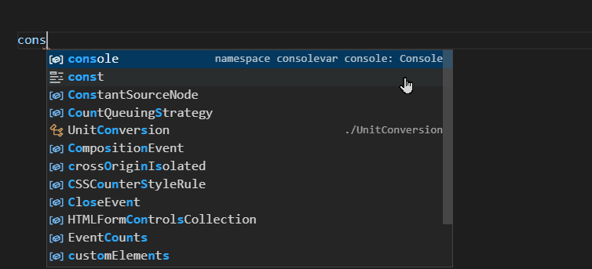

# ts-united-types

A library for creating, using, and tracking  `unit`-ed numbers -- that is, 'meters', 'seconds', 'volts', etc.

# Overview



There is a _type_ level to this units, ensuring that you only assign like-units to like-units.  It also supports tracking
ratio units -- that is meters per second or pounds per square inch.  It then enables switching between units either via
elimination (eg. take meters per second and multiple it by a seconds value, you get meters ) or by direct conversion 
(eg. meters converted to feet).

```typescript
const distance1 = scalar(5, 'm');	// type: UnitedScalar<'m'>
const distance2 = scalar(10, 'm');	// type: UnitedScalar<'m'>
const time  = scalar(3, 's');		// type: UnitedScalar<'s'>

// Add two scalars together.  This uses type-safety to enforce 
// unit compatibility.
const totalDistance = distance1.add(distance2); // type: UnitedScalar<'m'>
```

```typescript
// Convert a scalar to a ratio
const rate = totalDistance.divideBy(time); // type: UnitedRatio<'m','s'>, meters/second
const metersPerSecond = rate.value;
```


Additionally, via importing the [`convert-units`](https://github.com/convert-units/convert-units) library, runtime conversion
is enabled automatically for known units within the same category (Area, Distance, Time, etc).

```typescript
const secondsToHours = converter('s', 'h');	// type: UnitConversion<'s', 'h'>
const rateInHours = rate.convertDenominator(secondsToHours); // type: UnitedRatio<'m','h'> now meters/hour and the value has changed accordingly.
const metersPerHour = rateInHours.value;
```